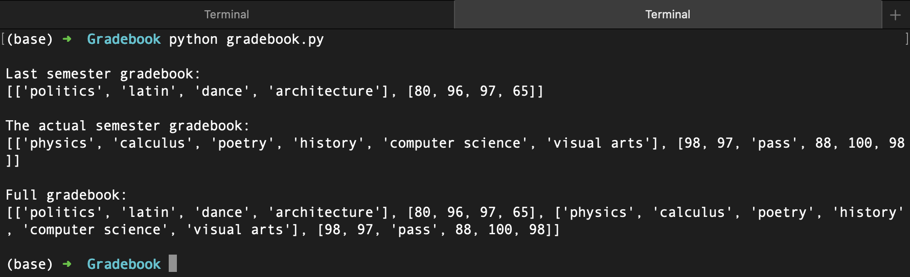

# Gradebook (codecademy project)

### What does it do ?
> Displays lists about gradings over two semesters (not mines)
> First list is the last semester gradebook.
> Second list is the actual semester gradebook.
> Third list is the combination of both gradebooks' lists.

### How does it looks ?
> 

### How do i use it ?
> Just type in the command line, or in VS or else : python gradebook.py
> (it can vary depending on the variable you use to execute python)

### How was it done?
> Using the CLI (except for the repo creation on GitHub), and Emacs (thinking about learning VIM later on because apparently more powerful. If needed, will do)

### Why ?
> Codecademy project that i modify.
> For example they don't ask to create the last semester gradebook like i did, instead they ask to display it like this: [['Class type', rating], ['Class type', rating], ... ]
> They didn't ask to comment the project, but i decided to, for me to deepen my understanding by reflecting more on what i just did ... without doing that, i wouldn't have been able to understand every step so clearly.
> They didn't ask to display the different lists with such formatting. Linear basic formatting was asked.